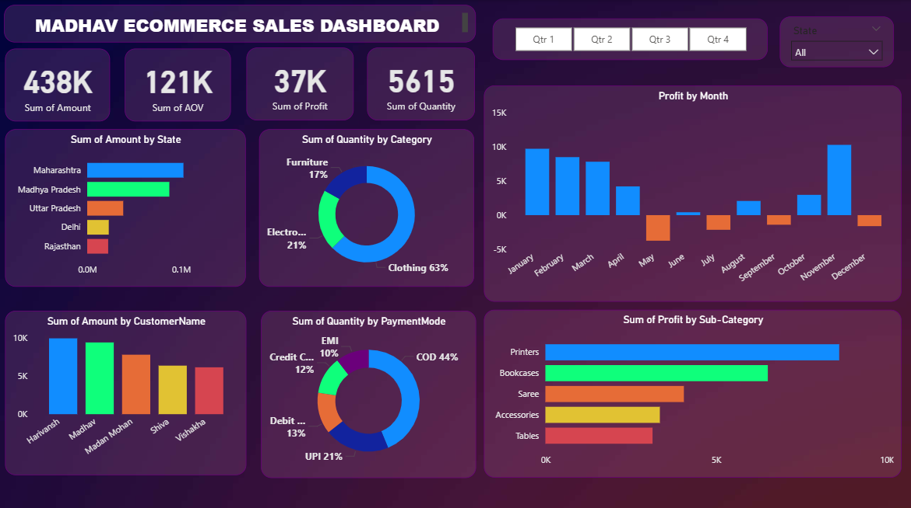

<div align="center">
  
</div>

---

## 📌 Overview
Interactive **Power BI dashboard** built to help a small e-commerce business track sales performance, identify top-selling categories and make data-driven decisions on inventory and regional marketing.

---

## 🎯 Problem Statement
The client needed a **single-view dashboard** to monitor revenue, profit and payment trends across states and quarters — replacing scattered Excel sheets with no unified reporting system.

---

## 🛠️ Tech Stack


---

## 🔍 What I Did

- ✅ Connected and transformed raw Excel data using **Power Query**
- ✅ Built **DAX measures** for dynamic KPIs — revenue, profit, quantity sold
- ✅ Designed **10-visual interactive dashboard** with Quarter and State slicers
- ✅ Delivered stakeholder-ready report with actionable regional insights
- ✅ Identified key business opportunities in category and payment trends

---

## 📊 Key Findings

| Metric | Value |
|---|---|
| 💰 Total Revenue | ₹4,38,000 |
| 📈 Total Profit | ₹37,000 |
| 🛒 Total Transactions | 5,615 |
| 🏆 Top Category | Clothing (63% of orders) |
| 🗺️ Highest Revenue State | Maharashtra |
| 💳 Dominant Payment Mode | COD (44%) |

---

## 💡 Business Impact

> **Clothing drives 63% of all orders** — a clear signal to prioritize inventory and promotional spend in this category.

> **COD at 44%** is the dominant payment mode — suggests opportunity to incentivize prepaid orders to reduce return risk and improve cash flow.

> **Maharashtra leads revenue** — targeted regional campaigns here would yield highest ROI.

---

## 📁 Repository Structure
```
Madhav-Sales-Dashboard/
├── 📂 Data/               → Raw Excel sales data
├── 📂 Dashboard/          → Power BI .pbix file
└── 📄 README.md
```

---
## 📸 Dashboard Preview



## 📫 Connect with Me

[](https://linkedin.com/in/sunainasinghda)
[](https://github.com/SunainaSingh56)
